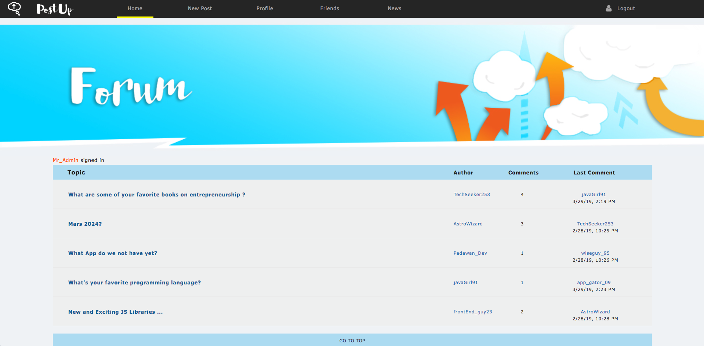
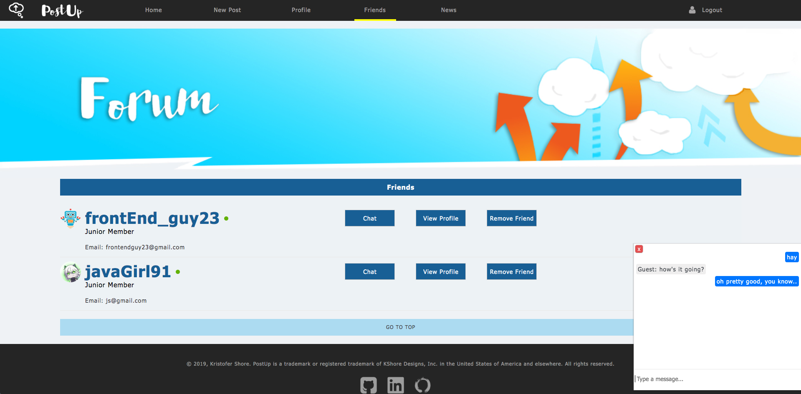

<<<<<<< HEAD
# PostUp
PostUp is a classic forum/message board style web app with a few added features. It's geared towards community and self improvement through the sharing of positive content and discussions. I built this app for fun and modeled it after the Fortnite forums.
## Technologies
- **NodeJS (Express)** server & framework
- **Angular** front-end
- **MongoDB** database
- **Socket.io** for live instant message chat
- **jQuery** library for effects & animations
- **NewsAPI** powered newsfeed links
## Functionality
Users can:
- Create and edit profiles
- Create posts and comment on posts from other members
- Add friends and chat with them live
- Browse top tech newsfeed articles
Admins can:
- Delete any content
## Screenshots
Landing

Friends

Post

=======
# PostUp
PostUp is a classic forum/message board style web app with a few added features. It's geared towards community and self improvement through the sharing of positive content and discussions. I built this app for fun and modeled it after the Fortnite forums. Live @ http://18.222.142.76
## Technologies
- **NodeJS (Express)** server & framework
- **Angular** front-end
- **MongoDB** database
- **Socket.io** for live instant message chat
- **jQuery** library for effects & animations
- **NewsAPI** powered newsfeed links
## Functionality
Users can:
- Create and edit profiles
- Create posts and comment on posts from other members
- Add friends and chat with them live
- Browse top tech newsfeed articles
Admins can:
- Delete any content
## Screenshots
Landing

Friends

Post

>>>>>>> dddabeb042f7cf92829f6a7d29d54123d9d0248d
